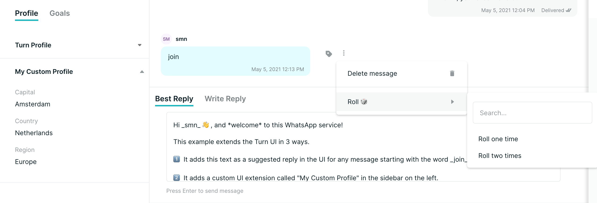
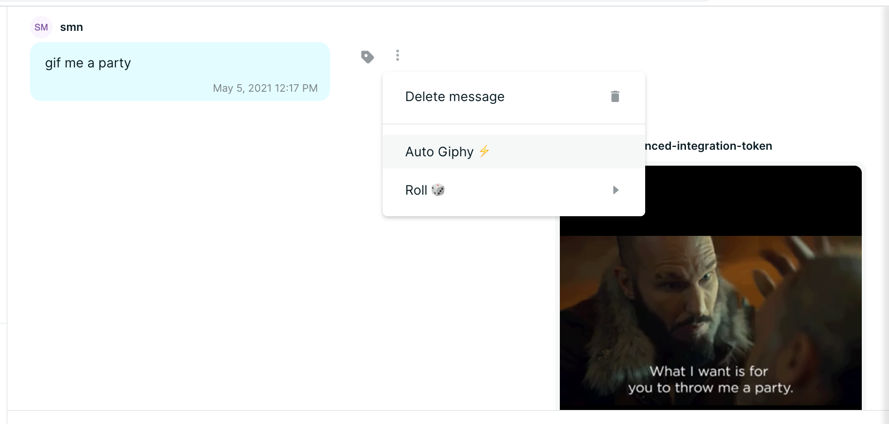

# turnio-integration-replit

An example Turn.io UI integration on Replit. This will augment the Turn UI with custom profile information, a suggested reply, and a custom action menu.

*This Replit assumes the following*:

1. You have gone through the [webhooks example](https://github.com/turnhub/turnio-webhooks-replit) and are comfortable with how to get an authentication for Turn and set it up as a secret in Repl.it
2. You have gone through the [DuckDuckGo suggested reply example](https://github.com/turnhub/turnio-duckduckgo-replit) and are comfortable with how to set up a `Custom Integration` in Turn.

# How to run this Repl.it

1. Click the `Run on Repl.it` button above and install this example into your Repl.it workspace.
2. Get a Turn token and add it as a secret called `TOKEN` in Repl.it
3. Sign-up for a free [Giphy developer API account](https://developers.giphy.com) and obtain an API token, add that as a secret called `GIPHY_API_TOKEN` in Repl.it
4. Set up the custom integration using the URL generated for your workspace by Repl.it
5. Send a message to your number and interact with the UI!

The `Roll 🎲` menu has two options, both of those hit a custom URL in this Repl.it, pick a random number between 1 and 6 and send the result back as a reply.

The `Auto Giphy ⚡️` menu will search Giphy for a gif matching the text of the message. We will then send the Gif back as an MP4 video as WhatsApp doesn't support gif natively in the API at the moment.

Here's a screenshot showing the custom profile addition, the suggested reply, and the roll a dice action menu:

Here's a screenshot showing the Giphy menu when a message contains the word `gif`:

